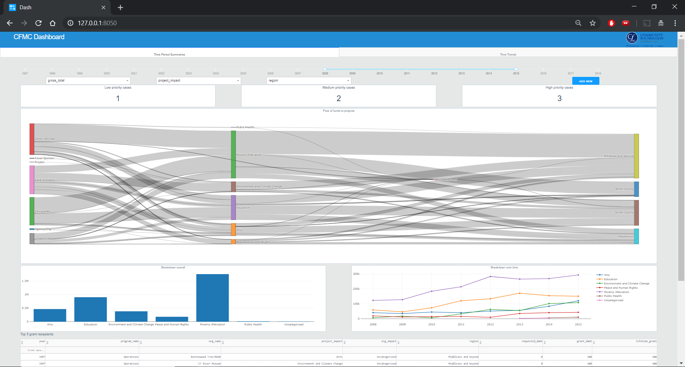

# CFMC Dashboard
This dashboard is for the use of the Board of Directors of the [Community Foundation of Middlesex County](https://middlesexcountycf.org). Trends in the incoming funds and the outgoing grants will be analyzed with the interactive visualizations on this dashboard. Eventually, a community-facing version will be constructed. 



# Usage

```
git clone https://github.com/fredcorpuz06/cfmc-dashboard.git
cd cfmc-dashboard
```
Check if you have installed all the Python package dependencies contained in `requirements.txt`. Then run in terminal
```
python index.py
```
You can now access dashboard at 
```
http://127.0.0.1:8050/
```

Additionally, a live version of this dashboard is deployed on Heroku at [https://cfmc-dashboard.herokuapp.com](https://cfmc-dashboard.herokuapp.com)


