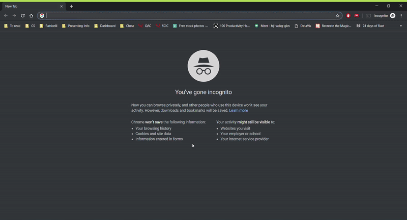

# CFMC Dashboard
This dashboard is for the use of the Board of Directors of the [Community Foundation of Middlesex County](https://middlesexcountycf.org). Trends in the incoming funds and the outgoing grants will be analyzed with the interactive visualizations on this dashboard. Eventually, a community-facing version will be constructed. 



👉[See my presentation here](https://docs.google.com/presentation/d/12u9zwlJS0NGWuW4Cp419TKtWGUNafRbr2FHAbzKmS4c/edit?usp=sharing)

# Usage

```
git clone https://github.com/fredcorpuz06/cfmc-dashboard.git
cd cfmc-dashboard
```
Check if you have installed all the Python package dependencies contained in `requirements.txt`. Then run in terminal
```
python index.py
```
You can now access dashboard at 
```
http://127.0.0.1:8050/
```

Additionally, a live version of this dashboard is deployed on Heroku at [https://cfmc-dashboard.herokuapp.com](https://cfmc-dashboard.herokuapp.com)


# Dashboard Features
* Interactive components
    * Year selection slider
    * Summary type dropdown
    * Variable selection dropdown
    * Nonprofit selection dropdown
* Visualizations
    * Sankey diagram: *display the flow of money from the different sources of funds (field of interest funds, donor-advised funds, etc.) to the project impact areas (poverty alleviation, arts, etc.) and the regions in Middlesex that the money flows to*
    


# Built with
* *Web App* - [Dash](https://dash.plot.ly/) is a Python framework built on top of Flask and React.js ideal for building highly custom user interfaces
* *Data Visualizations* - [Plotly](https://plot.ly/python/) is a graphing library for interactive, publication-quality graphs online
* *App Deployment Platform* - [Heroku](https://www.heroku.com/what) is a cloud platform that allows you to build, deliver, monitor and scale apps
* *Database* - [PostgreSQL](https://www.postgresql.org/) is an open source object-relational database management system with an emphasis on extensibility 

# Authors 
* [Frederick Corpuz](https://www.linkedin.com/in/frederick-corpuz-4392a713b/), student at Wesleyan University '20, analyzed the data, designed and built the visualizations, and deployed the dashboard for use
* [Thayer Talbott](https://www.linkedin.com/in/mttalbott/), Vice President of Programs & Operations at CFMC, provided data/domain expertise and consulted on the construction of the visualizations